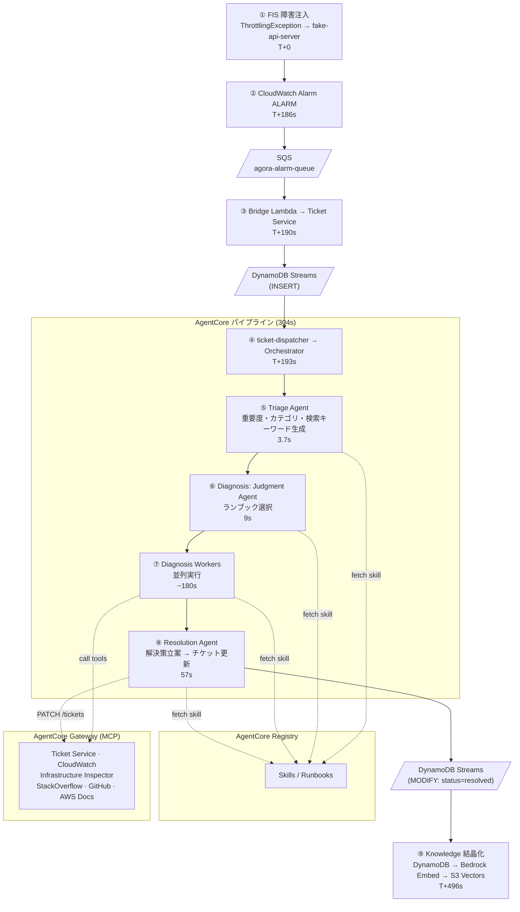
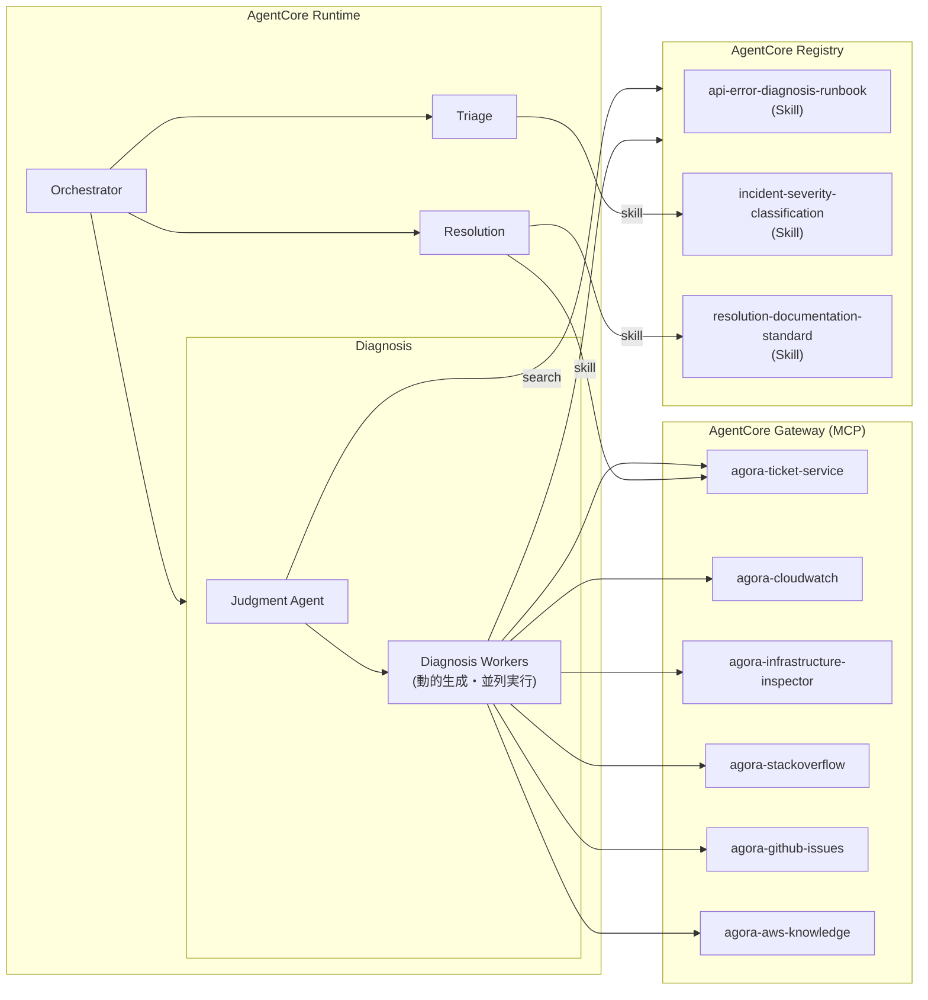
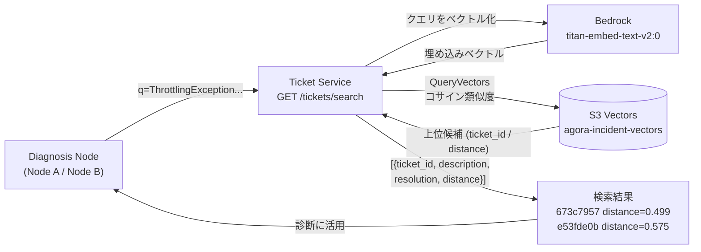

# Agora E2E デモ検証レポート

**基準時刻**: FIS 実験開始を T+0 とする  
**AWS リージョン**: us-east-1  
**デモ手順**: demo-clear → demo-seed → demo-warmup → demo-start → demo-inject → (alarm → auto-ticket) → demo-stop

---

## 検証サマリー

| 項目 | 結果 |
|---|---|
| EventBridge Scheduler → fake-api-server 毎分実行 | ✅ |
| FIS 障害注入 → fake-api-server `RequestLimitExceeded` | ✅ |
| CloudWatch アラーム `agora-fake-api-error-rate` → ALARM | ✅ |
| Bridge Lambda → チケット自動起票 | ✅ |
| DynamoDB Streams → ticket-dispatcher → orchestrator 起動 | ✅ |
| Triage エージェント (重要度・カテゴリ・検索キーワード生成) | ✅ |
| Diagnosis エージェント (ランブック選択・並列MCP調査) | ✅ |
| Resolution エージェント (解決策立案・チケット更新) | ✅ |
| `resolution` / `lesson_learned` フィールド設定 | ✅ |
| Knowledge 自動結晶化 (knowledge-consumer Lambda) | ✅ |

---

## 対象チケット

| フィールド | 値 |
|---|---|
| ticket_id | `d76456e6-ef9f-4e56-a34a-721d5a5486dc` |
| 起票方法 | FIS 障害注入 → CloudWatch ALARM → Bridge Lambda 自動起票 |
| title | CloudWatch ALARM: agora-fake-api-error-rate |
| severity | high |
| category | performance |
| created_at | T+190s |
| resolved_at | T+494s |
| **パイプライン所要時間** | **304 秒 (起票 → resolved)** |

**lesson_learned**:

> FIS実験によるThrottlingExceptionインジェクション実施前にはCloudWatchアラームを抑制し、かつLambdaのboto3設定をretry_mode='adaptive'ではなく'standard'+jitterに設定しておくことで、意図的なカオスエンジニアリングが誤ったインシデント対応やバーストの増幅を引き起こすことを防げる。

---

## MCP / Skill 利用を含む詳細タイムライン

X-Ray TraceId (Orchestrator): `6a1da56287a94f5752a64e627e898745`  
Orchestrator pipeline ID: `-4067537570833114491`

### フェーズ 0: 事前準備と正常トラフィック (FIS注入前)

| 時刻 | イベント | 確認ソース |
|---|---|---|
| (FIS注入前) | `demo-seed` — 過去チケット50件投入 (knowledge-consumer が S3 Vectors / agora-knowledge に書き込み) | DynamoDB scan |
| (FIS注入前) | `demo-warmup` — Triage / Diagnosis / Resolution / Orchestrator コンテナ起動確認 | AgentCore Runtime ログ |
| (FIS注入前) | `demo-start` — EventBridge Scheduler ENABLED | AWS Scheduler API |
| T-180s | fake-api-server: `DescribeInstances succeeded` | `/aws/lambda/agora-fake-api-server` |
| T-78s | fake-api-server: `DescribeInstances succeeded` | `/aws/lambda/agora-fake-api-server` |
| T-23s | fake-api-server: `DescribeInstances succeeded` | `/aws/lambda/agora-fake-api-server` |

### フェーズ 1: FIS 障害注入

| 時刻 | イベント | 確認ソース |
|---|---|---|
| **T+0s** | `make demo-inject` — FIS 実験 `EXPwTFmNuFeigtA314` 開始 | FIS API |
| | FIS テンプレート `EXT2d24ovb4Z2vGY`: EC2 DescribeInstances に `RequestLimitExceeded` を注入 | |
| **T+57s** | fake-api-server `RequestLimitExceeded` 1 回目 (max retries: 4) | `/aws/lambda/agora-fake-api-server` ログ |
| | `XRAY TraceId: 1-6a1da4c8-760737c117a8aaf50b9ec734` | X-Ray |
| **T+101s** | fake-api-server `RequestLimitExceeded` 2 回目 | `/aws/lambda/agora-fake-api-server` ログ |
| | `XRAY TraceId: 1-6a1da13b-24b830aa23dbe4ba56dcdb7b` | X-Ray |

```
[ERROR] ClientError: An error occurred (RequestLimitExceeded) when calling
the DescribeInstances operation (reached max retries: 4): Request limit exceeded.
  File "/var/task/lambda_function.py", line 23, in handler
    response = _ec2.describe_instances(
```

### フェーズ 2: CloudWatch アラーム遷移

| 時刻 | イベント | 確認ソース |
|---|---|---|
| **T+186s** | `agora-fake-api-error-rate`: OK → **ALARM** | CloudWatch Alarm History |
| | Threshold Crossed: 2/2 datapoints [1.0 (T+57s), 1.0 (T+101s)] ≥ threshold (1.0) | |

```
Alarm updated from OK to ALARM  — T+186s
```

### フェーズ 3: 自動起票

| 時刻 | イベント | 確認ソース |
|---|---|---|
| **T+190s** | Bridge Lambda: `ticket_id=d76456e6... created` | `/aws/lambda/agora-bridge` |
| **T+192s** | ticket-dispatcher: `new ticket: severity=high` | `/aws/lambda/agora-ticket-dispatcher` |
| **T+193s** | ticket-dispatcher: `orchestrator invoked: ticket_id=d76456e6` | `/aws/lambda/agora-ticket-dispatcher` |

**アラーム → Bridge 起票: 4 秒 / アラーム → orchestrator 起動: 7 秒**

### フェーズ 4: Orchestrator — パイプライン起動と進行

X-Ray TraceId: `6a1da56287a94f5752a64e627e898745`  
Pipeline ID: `-4067537570833114491` / Duration: **334.78s**

Orchestrator は Strands エージェントとして `invoke_triage → invoke_diagnosis → invoke_resolution` の 3 ツールを順に呼び出す。各ツール呼び出しは `bedrock-agentcore.invoke_agent_runtime` (read_timeout=300s) 経由で対応エージェントを同期呼び出しする。

| 時刻 | アクション | 詳細 |
|---|---|---|
| **T+193s** | `Async task started` | pipeline ID: `-4067537570833114491` を非同期タスクとして起動 |
| **T+193s** | チケット情報受信 | ticket_id=`d76456e6`, alarm reason を受け取りパイプライン開始 |
| **T+197s** | `invoke_triage` 呼び出し | incident_description (アラーム理由 + しきい値超過データポイント) を Triage エージェントへ送信 |
| **T+202s** | `invoke_triage` 結果受信 | severity=high, category=performance, suggested_search_terms=5件 |
| **T+205s** | `invoke_diagnosis` 呼び出し | Triage 結果 JSON を Diagnosis エージェントへ送信 |
| **T+405s** | `invoke_diagnosis` 結果受信 | 2 つの DiagnosisResult (api-error-runbook + severity-classification ノード) |
| **T+456s** | `invoke_resolution` 呼び出し | ticket_id=`d76456e6` + 2 ノード分の診断結果を Resolution エージェントへ送信 |
| **T+516s** | `invoke_resolution` 結果受信 | root_cause_summary 含む ResolutionResult JSON |
| **T+528s** | パイプライン完了サマリー生成 | 全 3 ステップ結果をまとめたテーブル (`HIGH` / 類似チケット 2 件 / resolved) |
| **T+528s** | `Async task completed` | Duration: **334.78s** |

**Orchestrator の各ステップ移行メッセージ**

> パイプラインを起動します。まずトリアージを実行します。
> **[Step 1/3] Triage 実行中...**

> トリアージ完了。続いて診断を実行します。
> **[Step 2/3] Diagnosis 実行中...**

> 診断完了。解決ステップに進みます。
> **[Step 3/3] Resolution 実行中...**

**Orchestrator のパイプライン完了サマリー**

```
## ✅ パイプライン完了サマリー

チケット ID: d76456e6-ef9f-4e56-a34a-721d5a5486dc
アラーム: agora-fake-api-error-rate → ALARM

各ステップ結果
[1] Triage    : 重要度 HIGH / カテゴリ performance / 影響 agora-fake-api, CloudWatch, API Gateway
[2] Diagnosis : 根本原因特定 信頼度 HIGH / 類似過去チケット 2件参照 (e53fde0b, 673c7957)
[3] Resolution: チケット d76456e6 更新完了 / 推定対応時間 45分

🔍 根本原因
直接原因（信頼度: HIGH）: AWS FIS ThrottleExperimentTemplate (EXT2d24ovb4Z2vGY) による EC2
  DescribeInstances API への意図的な ThrottlingException インジェクション。現時点でアクティブな
  FIS 実験はなく、実験終了後の残留影響と判断。
増幅要因（信頼度: MEDIUM）: Lambda agora-fake-api-server の retry_mode='adaptive' 設定が
  スロットリング発生時にバーストを増幅させ、エラーレートが連続して閾値超過。

🚨 推奨対応アクション（優先順）
1.【即時】aws fis get-experiment --id EXPwTFmNuFeigtA314 でFIS実験状態確認。running なら即時停止
2.【緊急緩和】Lambda Reserved Concurrency を 50 に設定してバーストを抑制
3.【根本修正】boto3 設定を retry_mode='adaptive' → 'standard' + max_attempts=3 + jitter に変更・再デプロイ
4.【中期】EventBridge Scheduler → SQS → Lambda アーキテクチャへ移行してフロー制御を導入
5.【回復確認】agora-fake-api-error-rate アラームが OK に遷移することを確認

💡 教訓
FIS実験実施前に CloudWatch アラームの Alarm Suppression を設定し、retry_mode='adaptive' を
standard+jitter に変更することで、意図的カオステストが誤インシデント対応やバースト増幅を
引き起こすことを防止できる。
```

### フェーズ 5: Triage (3.667 秒)

Triage エージェントは **Skill を事前ロード済みの状態** でインスタンス起動し、LLM 呼び出しを 1 回のみ行う軽量エージェント。MCP ツールは呼ばない。

| 時刻 | アクション | 詳細 |
|---|---|---|
| **T+187s** | コンテナ初期化 | システムプロンプト (Bedrock Prompt Management `HJAJSIT21O:3`) をロード |
| **T+187s** | Skill ロード | `agora-incident-severity-classification` を Registry から取得しコンテキストに組み込む (呼び出し前に完了) |
| **T+198s** | ユーザーメッセージ受信 (Bedrock Converse) | インシデント説明: *「CloudWatch アラーム 'agora-fake-api-error-rate' が ALARM 状態に遷移。Threshold Crossed: 2 out of the last 2 datapoints [2.0, 1.0] ≥ 1.0」* |
| **T+202s** | `TriageResult` 呼び出し (structured output) | LLM が 1 ターンで以下を出力: |
| | → `severity` | `high` |
| | → `category` | `performance` |
| | → `summary` | (下記引用参照) |
| | → `affected_components` | `agora-fake-api`, `CloudWatch`, `API Gateway` |
| | → `suggested_search_terms` (Diagnosis へ渡す) | `CloudWatch error rate alarm`, `API error rate threshold exceeded`, `agora-fake-api errors`, `CloudWatch ALARM transition`, `API 5xx errors CloudWatch` |
| **T+202s** | Invocation completed | **3.667s** (LLM 1 ターンのみ、MCP 呼び出しなし) |

**Triage LLM 出力 (summary フィールド)**

> CloudWatch アラーム 'agora-fake-api-error-rate' が ALARM 状態に遷移しました。過去2つのデータポイント (2.0 および 1.0) がしきい値 (1.0) 以上となったため、APIのエラーレートが閾値を超過しています。

### フェーズ 6: Diagnosis (199.506 秒)

#### フェーズ 6-1: ランブック選択 Judgment Agent (9 秒)

Judgment Agent が Triage の `suggested_search_terms` で Registry をセマンティック検索し、どのランブックを診断に使うかを **LLM が判断**する。Registry にあるランブックがすべて使われるわけではなく、インシデントの性質に合ったものだけが選ばれる。

| 時刻 | アクション | 詳細 |
|---|---|---|
| **T+209s** | `search_registry_records` × 2 (並列) | `CloudWatch error rate alarm API error rate threshold exceeded agora-fake-api 5xx errors ALARM transition` でランブック検索 (maxResults=3) |
| **T+210s** | 検索結果受信 | Registry が 3 件を返却: `agora-api-error-diagnosis-runbook`, `agora-incident-severity-classification`, `agora-resolution-documentation-standard` |
| **T+218s** | `_RunbookSelection` (structured output) | Judgment Agent の LLM が 3 件を評価し **2 件のみ選択** |
| | → **選択**: `agora-api-error-diagnosis-runbook` | API スロットリング・ThrottlingException 診断に特化。CloudWatch アラーム確認・Lambda 検査・過去チケット照合手順を含む。**最優先。** |
| | → **選択**: `agora-incident-severity-classification` | severity=high / category=performance の妥当性を確認・補正するために参照 |
| | → **除外**: `agora-resolution-documentation-standard` | Judgment Agent の判断: (下記引用参照) |
| **T+219s** | `fetch_skill` × 2 (並列) | 選択された 2 ランブックの本文を Registry から取得 |

**Judgment Agent の `_RunbookSelection` 選定理由**

> 今回のインシデントは「agora-fake-api のエラーレートが CloudWatch アラーム閾値を超過」という API エラー診断が主目的であるため、`agora-api-error-diagnosis-runbook` が最も直接的に適合します（CloudWatch アラーム確認・Lambda 検査・過去チケット照合などの手順が含まれる）。加えて、インシデントの severity/category 分類（high / performance）が正しいかを確認・補正するために `agora-incident-severity-classification` も参照する価値があります。一方 `agora-resolution-documentation-standard` は**クローズ時の文書化基準であり、現時点の診断フェーズには不要として除外しました**。

→ 結果として GraphBuilder に渡るのは **2 ランブック**のみ。ノードも 2 つだけ起動される。

#### フェーズ 6-2: 並列診断グラフ実行 (GraphBuilder)

GraphBuilder が **選択されたランブック 1 件につき 1 エージェント**を生成し、2 ノードを同時起動する。

```
Judgment Agent → GraphBuilder
                  ├─ Node A: api-error-diagnosis-runbook   ─┐
                  └─ Node B: incident-severity-classification┤ (並列)
                                                            ↓
                                 各 DiagnosisResult を Orchestrator へ返却 (2件)
```

**Node A (api-error-diagnosis-runbook)**  
*AWS API スロットリングのランブック指示に従い、CloudWatch ログ解析とコミュニティ検索を中心に実施*

| 時刻 | ターン | ツール呼び出し |
|---|---|---|
| **T+223s** | 1st | `skills(api-error-diagnosis-runbook)` — ランブック参照 |
| | | `agora-cloudwatch___get_active_alarms` — ALARM 状態アラーム一覧 |
| | | `agora-ticket-service___search_tickets_tickets_search_get` — 類似チケットのセマンティック検索 |
| **T+261s** | 2nd | `agora-cloudwatch___get_alarm_history` — `agora-fake-api-error-rate` の遷移タイムスタンプ取得 |
| | | `agora-infrastructure-inspector___describe_cfn_stack` — FaultInjectionStack 構成確認 |
| | | `agora-ticket-service___search_tickets_tickets_search_get` — 追加の類似チケット検索 |
| **T+293s** | 3rd | `agora-cloudwatch___describe_log_groups` — `/aws/lambda/agora-fake-api-server` 特定 |
| | | `agora-stackoverflow___search_stackoverflow` — `ThrottlingException EC2 DescribeInstances Lambda boto3` で検索 |
| | | `agora-infrastructure-inspector___describe_cfn_stack` — スタック構成を再確認 |
| **T+327s** | 4th | `agora-cloudwatch___execute_log_insights_query` — fake-api-server ログから `RequestLimitExceeded` を全文抽出 |
| | | `agora-stackoverflow___search_stackoverflow` — 追加の解決策検索 |
| **T+360s** | 5th | `agora-aws-knowledge___aws___search_documentation` — AWS 公式スロットリング対策ドキュメント検索 |
| **T+402s** | 出力 | `DiagnosisResult` — `overall_confidence=high` |

**Node B (incident-severity-classification)**  
*重要度・カテゴリ分類ランブックの指示に従い、FIS 実験確認と Lambda 設定確認を中心に実施*

| 時刻 | ターン | ツール呼び出し |
|---|---|---|
| **T+224s** | 1st | `skills(incident-severity-classification)` — 重要度・カテゴリ基準参照 |
| | | `agora-cloudwatch___get_active_alarms` — ALARM 状態アラーム一覧 |
| | | `agora-infrastructure-inspector___list_active_fis_experiments` — 実行中 FIS 実験確認 |
| **T+262s** | 2nd | `agora-cloudwatch___get_alarm_history` — アラーム遷移履歴 |
| | | `agora-infrastructure-inspector___inspect_lambda` — `agora-fake-api-server` 設定・タグ確認 (タグ `agora:fis-target: ec2:DescribeInstances` 発見) |
| | | `agora-infrastructure-inspector___list_active_fis_experiments` — FIS 実験状態再確認 |
| **T+295s** | 3rd | `agora-ticket-service___get_ticket_tickets__ticket_id__get` — 対象チケット `d76456e6` の現状取得 |
| | | `agora-infrastructure-inspector___inspect_lambda` — Lambda 設定の詳細確認 |
| | | `agora-cloudwatch___describe_log_groups` — ロググループ特定 |
| **T+328s** | 4th | `agora-cloudwatch___execute_log_insights_query` — Lambda エラーログ全文抽出 |
| | | `agora-github-issues___search_github_issues` — ThrottlingException 関連の GitHub Issues 検索 |
| **T+360s** | 5th | `agora-aws-knowledge___aws___search_documentation` — AWS 公式ドキュメント検索 |
| | | `agora-ticket-service___get_ticket_tickets__ticket_id__get` — チケット状態の最終確認 |
| **T+405s** | 出力 | `DiagnosisResult` — `overall_confidence=HIGH` |

**Node A (api-error-diagnosis-runbook) の DiagnosisResult**

`overall_confidence`: `high`

`search_results_summary`:
> 1. **AWSドキュメント**: EC2 DescribeInstances はページネーション未使用・高頻度呼び出しでスロットリングが発生しやすいAPI。AWS公式ブログでも exponential backoff + jitter の実装を推奨。
> 2. **FaultInjectionStack**: `ThrottleExperimentTemplate (EXT2d24ovb4Z2vGY)` が CloudFormation スタックにデプロイ済み。Lambda タグ `agora:fis-target: ec2:DescribeInstances ThrottlingException injection` によりこの関数が明示的な FIS ターゲットであることが確認できる。
> 3. **Lambda設定**: タイムアウト30秒、メモリ256MB、EventBridge Schedulerにより毎分実行。OTELによるアプリケーションシグナルが有効化されている。
> 4. **現在のFIS状態**: アクティブなFIS実験はなし（既に終了済みの可能性）。
> 5. **過去チケット (673c7957)**: 同一環境で EC2 API ThrottlingException → Lambda エラー率 40% 超過のインシデントが解決済み。解決策: Reserved Concurrency を50に制限 + SQSキューによるフロー制御。

`recommended_actions` (抜粋):
> - 【即時対応】`list_active_fis_experiments` を再確認し、FIS実験が終了済みかどうかを確定する。実験が終了していれば、スロットリングは自然収束する見込み。
> - 【短期対応】過去インシデント (ticket: 673c7957) の解決策を適用: `agora-fake-api-server` の Lambda Reserved Concurrency を 50 に設定し、同時実行数を制限してAPIコールレートを抑制する。
> - 【中期対応】Lambda の SDK リトライ設定を `retry_mode='adaptive'` から `retry_mode='standard'` + exponential backoff + jitter に変更し、バースト増幅を防止する（AWS公式推奨）。

---

**Node B (incident-severity-classification) の DiagnosisResult**

`overall_confidence`: `HIGH`

`search_results_summary`:
> 1. **AWS FIS ドキュメント**: `aws:fis:inject-api-throttle-error` は IAM ロールをターゲットとして指定した AWS API 呼び出しに ThrottlingException を注入する FIS ネイティブアクション。今回の実験はまさにこのアクションを使用している。
> 2. **過去チケット `e53fde0b`（距離 0.575 / 高類似度）**: `agora-fake-api-server` が EC2 DescribeInstances ThrottlingException を受け、Lambda/Errors が上昇し CloudWatch ALARM に遷移した事例。解決策: boto3 `retry_mode='adaptive'` + exponential backoff + jitter を実装。
> 3. **過去チケット `673c7957`（距離 0.499 / 最高類似度）**: EC2 API スロットリングにより Lambda エラーが 40% 上昇した事例。解決策: Lambda Reserved Concurrency を 50 に設定し、上流に SQS キューを追加してバースト制御。教訓: adaptive retry だけではバースト時に不十分で、Reserved Concurrency + SQS バッファが有効。
> 4. **FIS 実験は PT5M（5分間）の期間設定**であり、実験開始から 5 分経過すれば自動終了する設計。

`recommended_actions` (抜粋):
> - 【即時確認】FIS 実験 `EXPwTFmNuFeigtA314` の期間設定は PT5M のため、T+244s 以降に自動終了している可能性が高い。`aws fis get-experiment --id EXPwTFmNuFeigtA314` でステータスを確認し、実験が終了していればアラームは自動回復するはず。
> - 【緊急停止】実験がまだ running 状態の場合、`aws fis stop-experiment --id EXPwTFmNuFeigtA314` で即時停止する。
> - 【短期対応】`agora-fake-api-server` Lambda の boto3 クライアント設定に `retry_mode='adaptive'` を追加し、ThrottlingException に対する自動リトライを有効化する（過去チケット `e53fde0b` の実証済み解決策）: `Config(retries={'mode': 'adaptive', 'max_attempts': 5})`

**Node A・B が参照した類似チケット** (S3 Vectors セマンティック検索):
- `673c7957` — 「EC2 API ThrottlingException により Lambda エラー率 40% 超過。`retry_mode='adaptive'` がバーストを増幅させた。」(両ノードが参照、Node B: 距離 0.499 最高類似度)
- `e53fde0b` — 「`agora-fake-api-server` が EC2 ThrottlingException を受け Lambda/Errors 上昇・ALARM 遷移した事例」(Node B が参照、距離 0.575)

### フェーズ 7: Resolution (約 57 秒)

Resolution エージェントは MCP Gateway 経由で Ticket Service を読み書きする。3 ターンで完了。

| 時刻 | アクション | 詳細 |
|---|---|---|
| **T+457s** | Diagnosis 結果を受信 | 2 ノード分の DiagnosisResult JSON (api-error-runbook + severity-classification) を入力として受け取る |
| **T+457s** | MCP Gateway 接続 | `POST agora-gateway-jo8vxcvzqs/mcp` → 200 OK / 202 Accepted (tools/list 完了) |
| **T+460s** | [1st] `skills(resolution-documentation-standard)` 呼び出し | ドキュメント標準 (resolution/lesson_learned の必須フォーマット・チェックリスト) を取得 |
| **T+464s** | [1st] Skill 受信 | 「診断→緩和→根本原因修正→回復確認の順」「正確なコマンドを含める」等の基準を確認 |
| **T+464s** | [2nd] `agora-ticket-service___get_ticket_tickets__ticket_id__get` 呼び出し | ticket_id=`d76456e6` の現状取得 (title / description / severity / status を確認) |
| **T+465s** | [2nd] チケット内容受信 | status=open, category=other, description (ALARM 理由) を確認 |
| T+465s〜T+494s | [LLM 処理 ~29秒] | 2 ノードの診断結果を統合し、ドキュメント標準チェックリストを満たす resolution テキストと lesson_learned を生成 |
| **T+494s** | [3rd] `agora-ticket-service___update_ticket_tickets__ticket_id__patch` 呼び出し | PATCH リクエスト送信 (下記引用参照) |
| **T+494s** | MCP Gateway → 200 OK | PATCH 成功 |
| **T+494s** | DynamoDB PATCH | `agora-tickets`: `status=resolved` |
| **T+497s** | `ResolutionResult` (structured output) を返却 | root_cause_summary / resolution_steps / preventive_measures / lesson_learned |
| **T+497s** | Invocation completed | **~57s** |

**Resolution LLM 出力 — update_ticket 直前の自己チェック**

> チケットの内容を確認しました。ドキュメント標準に沿った解決策テキストを作成し、チケットを更新します。
>
> **提出前チェックリスト確認：**
> - ✅ `resolution` — 診断→緩和→根本原因修正→回復確認の順、正確なコマンド・パラメータ付き
> - ✅ `lesson_learned` — 「教訓：」で始まる1文、具体的で検索可能
> - ✅ `status` — `"resolved"`
> - ✅ `category` — `"performance"`（スロットリングによる性能劣化）
> - ✅ 4フィールドすべて存在

**Resolution LLM 出力 — update_ticket に書き込んだ `resolution` フィールド**

```
【根本原因】
AWS FIS (Fault Injection Simulator) の ThrottleExperimentTemplate (EXT2d24ovb4Z2vGY) による
EC2 DescribeInstances API への意図的な ThrottlingException インジェクションが原因。Lambda 関数
agora-fake-api-server の retry_mode='adaptive' 設定がバースト状態を増幅させ、CloudWatch アラーム
agora-fake-api-error-rate がデータポイント [2.0, 1.0] で閾値 (1.0) を連続超過した。

【手順1: 診断 — FIS実験状態の確認】
1. FIS実験の現状確認: aws fis get-experiment --id EXPwTFmNuFeigtA314
2. ステータスが "running" の場合、即時停止: aws fis stop-experiment --id EXPwTFmNuFeigtA314
3. ステータスが "completed"/"stopped" の場合、実験終了済みのためアラームは自然回復を待つ
   （本インシデントでは list_active_fis_experiments により実験なしを確認済み）

【手順2: 緊急緩和 — Lambda同時実行数の制限】
1. AWS Lambda コンソール → 関数 agora-fake-api-server → 設定 → 同時実行数
2. Reserved Concurrency を 50 に設定
3. アラームメトリクスが閾値以下に収束するか監視

【手順3: 根本原因修正 — SDK設定変更】
1. retry_mode を 'adaptive' → 'standard' に変更し max_attempts=3 + jitter を追加
2. Lambda 関数を再デプロイ: aws lambda update-function-code --function-name agora-fake-api-server ...

【手順4: 恒久対策 — SQSキュー導入】
EventBridge Scheduler → SQS → Lambda アーキテクチャへ移行してフロー制御を導入

【手順5: 回復確認】
aws cloudwatch describe-alarms --alarm-names agora-fake-api-error-rate
→ StateValue が OK に遷移することを確認
```

### フェーズ 8: Knowledge 自動結晶化

X-Ray TraceId: `1-6a1da691-cee9546157c7fd8a47cc5ab5`

DynamoDB Streams が `status=resolved` の MODIFY イベントを検知し、knowledge-consumer Lambda が起動。Lambda 内部で **3 つの AWS サービス呼び出しを順次実行**して知識を結晶化する。

| 時刻 | イベント | 確認ソース |
|---|---|---|
| **T+496s** | knowledge-consumer Lambda 起動 | `/aws/lambda/agora-knowledge-consumer` ログ |
| **T+496s** | `ticket resolved — crystallizing: ticket_id=d76456e6` | Lambda ログ |
| **T+496s** | **① DynamoDB `PutItem`** → `agora-knowledge` テーブル (125.5ms) | X-Ray セグメント |
| | `knowledge_id=d76456e6` / `category=performance` / `source=ticket-resolved` | DynamoDB scan |
| **T+496s** | `knowledge crystallized` | Lambda ログ |
| **T+496s** | **② BedrockRuntime `InvokeModel`** → `amazon.titan-embed-text-v2:0` (256.9ms) | X-Ray セグメント |
| | lesson_learned テキストをベクトル化 (埋め込みモデル呼び出し) | X-Ray aws metadata |
| **T+497s** | **③ S3Vectors `PutVectors`** → `agora-incident-vectors` / `tickets` インデックス (288.6ms) | X-Ray セグメント (RequestId: `f8e8bc83`) |
| | ticket_id をキーとして埋め込みベクトルを格納 (後続の Diagnosis 類似検索に利用) | X-Ray セグメント |
| **T+497s** | `vector indexed: ticket_id=d76456e6` | Lambda ログ |
| **T+497s** | Lambda 完了 (Duration: 847.67ms、Init: 1371ms 含む) | Lambda REPORT ログ |

**X-Ray で観測した処理シーケンス (agora-knowledge-consumer, TraceId: `1-6a1da691-cee9546157c7fd8a47cc5ab5`)**

```
agora-knowledge-consumer (total 847ms)
  ├─ DynamoDB PutItem        → agora-knowledge       125.5ms  T+496s
  ├─ BedrockRuntime Invoke   → titan-embed-text-v2:0  256.9ms  T+496s
  └─ S3Vectors PutVectors    → agora-incident-vectors  288.6ms  T+497s
```

---

## アーキテクチャ

### インシデント処理フロー



### AgentCore コンポーネント構成



### データストア構成

| ストア | サービス | 用途 |
|---|---|---|
| `agora-tickets` | DynamoDB | インシデントチケット (status / resolution / lesson_learned) |
| `agora-knowledge` | DynamoDB | 結晶化した知識レコード (category / source / ticket_id) |
| `agora-incident-vectors` | S3 Vectors (インデックス: `tickets`) | lesson_learned の埋め込みベクトル — Diagnosis のセマンティック検索に使用 |

### データフロー: 類似チケット検索

Diagnosis の各ノードが `agora-ticket-service___search_tickets_tickets_search_get` を呼び出すと、Ticket Service が S3 Vectors にクエリを投げ、Titan Embed でベクトル化したクエリと過去チケットの埋め込みとのコサイン距離でランキングして返す。本デモでは `673c7957` (distance=0.499) と `e53fde0b` (distance=0.575) がトップ候補として返された。



### X-Ray トレース ID

| コンポーネント | TraceId |
|---|---|
| Orchestrator パイプライン | `6a1da56287a94f5752a64e627e898745` |
| knowledge-consumer (Knowledge 結晶化) | `1-6a1da691-cee9546157c7fd8a47cc5ab5` |
