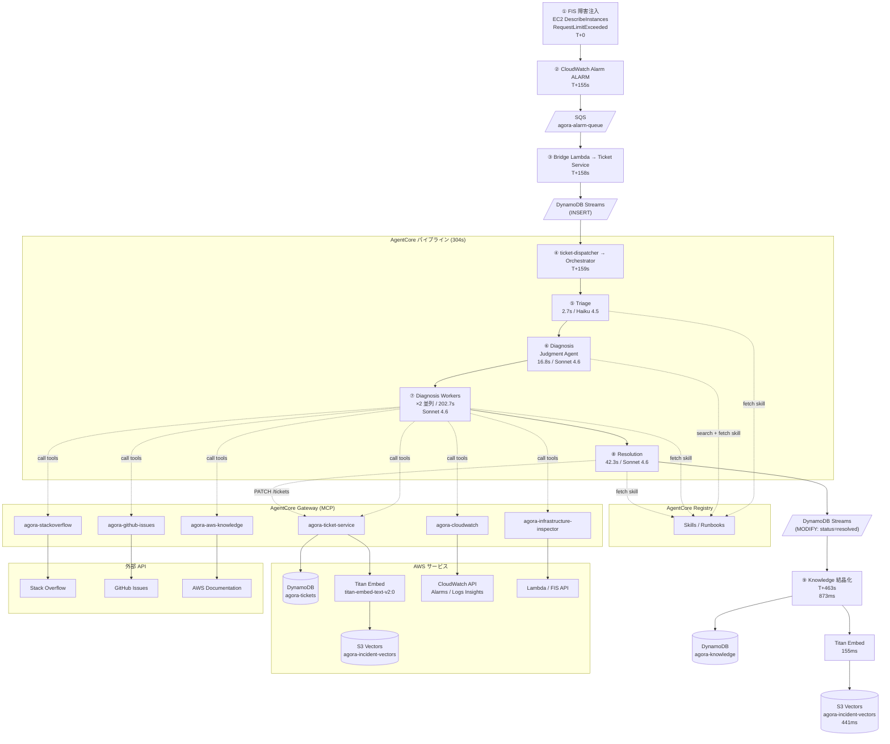
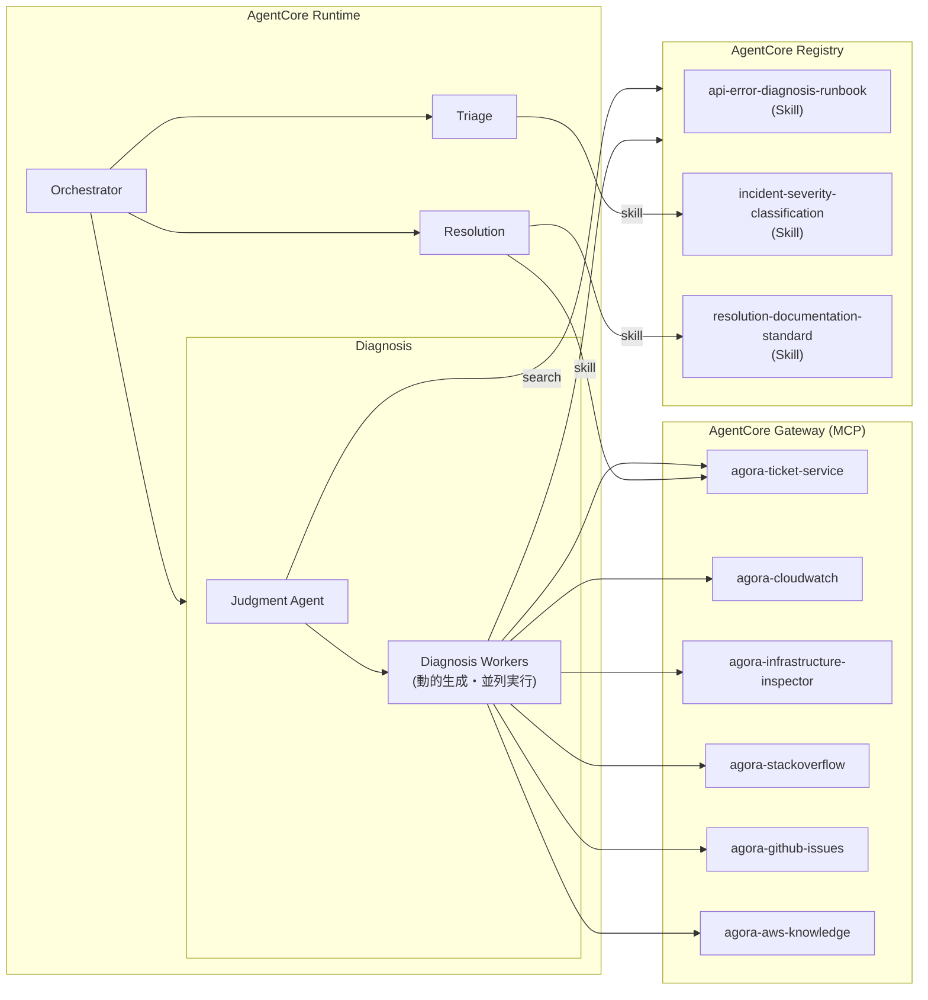
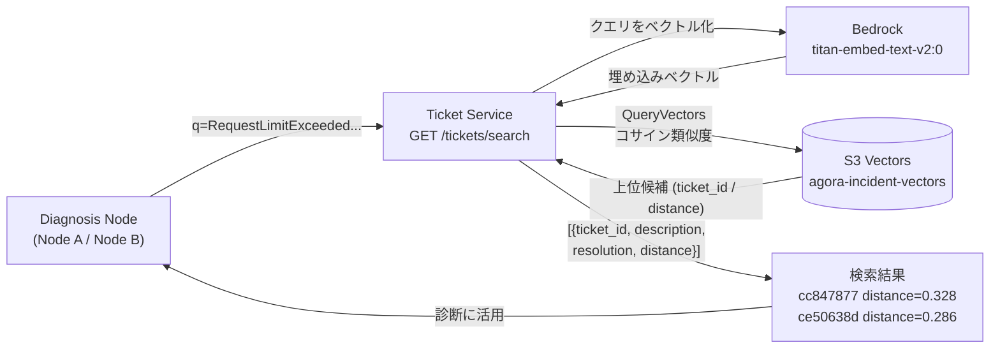

# Agora E2E デモ検証レポート

**基準時刻**: FIS 実験開始を T+0 とする  
**AWS リージョン**: us-east-1  
**実行日時**: [redacted]  
**デモ手順**: demo-clear → demo-seed → demo-warmup → demo-start → demo-inject → (alarm → auto-ticket) → demo-stop

---

## このデモが実証したこと

> Amazon Bedrock + AgentCore + Strands Agents を使えば、複数の AI エージェントが協調してインシデント対応を自動化するシステムを、フルマネージドかつエンドツーエンドで構築できる。

### ① エンドツーエンドの自動化が実機で動いた

FIS 障害注入 (T+0) から Knowledge 結晶化 (T+463s) まで、**人手の介入はゼロ**。

| マイルストーン | 経過時間 |
|---|---|
| FIS 注入 → CloudWatch ALARM | T+155s |
| ALARM → チケット自動起票 | **+3s** (T+158s) |
| 起票 → Orchestrator 起動 | **+1s** (T+159s) |
| 起票 → `status=resolved` | **+304s** (T+462s) |
| resolved → Knowledge/S3 Vectors 格納 | **+1s** (T+463s) |

「概念図」ではなく実際の AWS X-Ray トレース (`6a1ed8ea-7226456ef18bb6b57c931ee7`、334.917s) として記録されている。

### ② AgentCore の各機能がデモのどのシーンで何を解決したか

| AgentCore 機能 | 解決したこと | このトレースでの証拠 |
|---|---|---|
| **Runtime** | 5エージェント・4 MCP サーバーをコンテナとしてホスト。AG-UI / A2A / MCP のプロトコル処理をコードなしで担う | ticket-dispatcher → `InvokeAgentRuntime` (512ms) でコンテナ起動。各エージェントが別コンテナとして応答 |
| **Gateway** | Ticket Service の REST API を MCP ツールとして自動公開。エージェント導入後も API 仕様は無変更 | Resolution が `agora-ticket-service___update_ticket_tickets__ticket_id__patch` を呼び出し PATCH 成功 (T+462s) |
| **Registry** (セマンティック検索) | Diagnosis が症状に合うランブックを動的選択。エンドポイントをコードに書かずに済む | Judgment Agent が `search_registry_records` で3件を取得し `_RunbookSelection` で2件に絞り込み (T+227s)。resolution-documentation-standard は「診断フェーズには不要」と自律判断して除外 |
| **Registry** (capability 発見) | Resolution が MCP Gateway URL をコード埋め込みなしに動的取得 | `Discovered MCP Gateway URL from Registry` (T+438s) |
| **Observability** | Bridge Lambda → Orchestrator → Triage → Diagnosis → Resolution の全処理チェーンが単一トレースとして可視化。コード変更なし | TraceId `6a1ed8ea-7226456ef18bb6b57c931ee7` に 17 LLM calls・5 Titan Embed calls を含む全スパンが集約 |

### ③ 設計判断がトレースで検証された

| 設計判断 (PITCH より) | 実測結果 |
|---|---|
| Triage に Haiku を使う（分類特化・高速・低コスト） | 2.635s / 1,508 tokens で完了。Sonnet を使う他エージェントより桁違いに軽量 |
| `strategy="auto"` で Prompt Caching を自動有効化 | Diagnosis Workers の後半ターンで新規 input がほぼゼロ。**Sonnet 4.6 の実効キャッシュ再利用率 91%** (cache_read 74,795 tokens) |
| DynamoDB Streams を2箇所で使い Ticket Service を変更しない | INSERT (T+158s) → ticket-dispatcher・MODIFY resolved (T+462s) → knowledge-consumer が両方とも自動起動 |
| S3 Vectors を類似インシデント検索に使う | Diagnosis Workers が `cc847877` (距離 0.328) / `ce50638d` (距離 0.286) を発見し、解決策に反映 |
| Registry でエンドポイントをハードコードしない | Diagnosis (T+189s) と Resolution (T+438s) がそれぞれ起動時に Registry から動的解決 |

---

## 検証サマリー

| 項目 | 結果 |
|---|---|
| EventBridge Scheduler → fake-api-server 毎分実行 | ✅ |
| FIS 障害注入 → fake-api-server `RequestLimitExceeded` | ✅ |
| CloudWatch アラーム `agora-fake-api-error-rate` → ALARM | ✅ |
| Bridge Lambda → チケット自動起票 | ✅ |
| DynamoDB Streams → ticket-dispatcher → orchestrator 起動 | ✅ |
| Triage エージェント (重要度・カテゴリ・検索キーワード生成) | ✅ |
| Diagnosis エージェント (ランブック選択・並列MCP調査) | ✅ |
| Resolution エージェント (解決策立案・チケット更新) | ✅ |
| `resolution` / `lesson_learned` フィールド設定 | ✅ |
| Knowledge 自動結晶化 (knowledge-consumer Lambda) | ✅ |

---

## 対象チケット

| フィールド | 値 |
|---|---|
| ticket_id | `f2be1512-5eda-4566-92e6-cbaccc642de0` |
| 起票方法 | FIS 障害注入 → CloudWatch ALARM → Bridge Lambda 自動起票 |
| title | CloudWatch ALARM: agora-fake-api-error-rate |
| severity | high |
| category | network (Triage は performance と判定 → Diagnosis ランブックが network に再分類) |
| created_at | T+158s |
| resolved_at | T+462s |
| **パイプライン所要時間** | **304 秒 (起票 → resolved)** |

**lesson_learned**:

> 教訓：AWS FIS カオステスト実施前に必ず CloudWatch アラームのサプレス設定を行い、計画済みフォルト注入による誤インシデント通報を防ぐとともに、Lambda の AWS API 呼び出しには botocore adaptive リトライ＋Circuit Breaker を実装してスロットリング耐性を確保すること。

---

## MCP / Skill 利用を含む詳細タイムライン

X-Ray TraceId (Orchestrator): `6a1ed8ea7226456ef18bb6b57c931ee7`  
Orchestrator pipeline ID: `5140180711550228010` / Duration: **334.12s**

### フェーズ 0: 事前準備と正常トラフィック (FIS注入前)

| 時刻 | イベント | 確認ソース |
|---|---|---|
| (FIS注入前) | `demo-seed` — 過去チケット50件投入 (knowledge-consumer が S3 Vectors / agora-knowledge に書き込み) | DynamoDB scan |
| (FIS注入前) | `demo-warmup` — Triage / Diagnosis / Resolution / Orchestrator コンテナ起動確認 | AgentCore Runtime ログ |
| (FIS注入前) | `demo-start` — EventBridge Scheduler ENABLED | AWS Scheduler API |
| T-109s | fake-api-server: `DescribeInstances succeeded` | `/aws/lambda/agora-fake-api-server` |
| T-49s | fake-api-server: `DescribeInstances succeeded` | `/aws/lambda/agora-fake-api-server` |

### フェーズ 1: FIS 障害注入

| 時刻 | イベント | 確認ソース |
|---|---|---|
| **T+0s** | `make demo-inject` — FIS 実験 `EXPgmMfXRHzVxXQZ1k` 開始 | FIS API |
| | テンプレート `EXT2d24ovb4Z2vGY`: `agora-fake-api-role` に対して EC2 DescribeInstances へ `RequestLimitExceeded` を注入 (100%, PT5M) | |
| **T+63s** | fake-api-server `RequestLimitExceeded` 1 回目 (max retries: 4) | `/aws/lambda/agora-fake-api-server` ログ |
| **T+123s** | fake-api-server `RequestLimitExceeded` 2 回目 | `/aws/lambda/agora-fake-api-server` ログ |
| **T+135s** | fake-api-server `RequestLimitExceeded` 3 回目 | `/aws/lambda/agora-fake-api-server` ログ |

```
[ERROR] ClientError: An error occurred (RequestLimitExceeded) when calling
the DescribeInstances operation (reached max retries: 4): Request limit exceeded.
  File "/var/task/lambda_function.py", line 23, in handler
    response = _ec2.describe_instances(
```

### フェーズ 2: CloudWatch アラーム遷移

| 時刻 | イベント | 確認ソース |
|---|---|---|
| **T+155s** | `agora-fake-api-error-rate`: OK → **ALARM** | CloudWatch Alarm History |
| | Threshold Crossed: 2/2 datapoints [1.0, 1.0] ≥ threshold (1.0) | |
| **T+385s** | `agora-fake-api-error-rate`: ALARM → **OK** (FIS PT5M 後自動終了) | CloudWatch Alarm History |

```
Alarm updated from OK to ALARM  — T+155s
```

### フェーズ 3: 自動起票

| 時刻 | イベント | 確認ソース |
|---|---|---|
| **T+158s** | Bridge Lambda: `ticket_id=f2be1512... created` | `/aws/lambda/agora-bridge` |
| **T+159s** | ticket-dispatcher: `new ticket: severity=high` | `/aws/lambda/agora-ticket-dispatcher` |
| **T+159s** | ticket-dispatcher: `orchestrator invoked: ticket_id=f2be1512` | `/aws/lambda/agora-ticket-dispatcher` |

**アラーム → Bridge 起票: 3 秒 / アラーム → orchestrator 起動: 4 秒**

### フェーズ 4: Orchestrator — パイプライン起動と進行

X-Ray TraceId: `6a1ed8ea7226456ef18bb6b57c931ee7`  
Pipeline ID: `5140180711550228010` / Duration: **334.12s**

Orchestrator は Strands エージェントとして `invoke_triage → invoke_diagnosis → invoke_resolution` の 3 ツールを順に呼び出す。各ツール呼び出しは `bedrock-agentcore.invoke_agent_runtime` 経由で対応エージェントを同期呼び出しする。

| 時刻 | アクション | 詳細 |
|---|---|---|
| **T+159s** | `Async task started` | pipeline ID: `5140180711550228010` を非同期タスクとして起動 |
| **T+159s** | チケット情報受信 (Bedrock Converse) | `新規インシデントチケット f2be1512 が起票されました。タイトル: CloudWatch ALARM: agora-fake-api-error-rate` |
| **T+164s** | `invoke_triage` 呼び出し (tool call) | incident_description (アラーム理由 + しきい値超過データポイント) を Triage エージェントへ送信 |
| **T+164s** | `agora-triage-agent` ARN を Registry から解決 | Discovered runtime ARN for 'agora-triage-agent' from Registry |
| **T+167s** | `invoke_triage` 結果受信 | TriageResult JSON 返却 |
| **T+171s** | `invoke_diagnosis` 呼び出し (tool call) | triage_result JSON を Diagnosis エージェントへ送信 |
| **T+171s** | `agora-diagnosis-agent` ARN を Registry から解決 | Discovered runtime ARN for 'agora-diagnosis-agent' from Registry |
| **T+393s** | `invoke_diagnosis` 結果受信 | DiagnosisResult JSON 返却 |
| **T+437s** | `invoke_resolution` 呼び出し (tool call) | ticket_id=`f2be1512` + diagnosis_result JSON を Resolution エージェントへ送信 |
| **T+481s** | `invoke_resolution` 結果受信 | ResolutionResult JSON 返却 |
| **T+493s** | `Async task completed` | Duration: **334.12s** |

**Orchestrator の各ステップ移行メッセージ (OTel span ログより)**

> パイプライン起動を確認しました。チケット `f2be1512-5eda-4566-92e6-cbaccc642de0` の診断を開始します。
> **## Step 1 / 3 — Triage**

> トリアージ完了。重要度: **high** / カテゴリ: **performance**。続けて診断を実行します。
> **## Step 2 / 3 — Diagnosis**

> 診断完了。根本原因: **FIS による意図的な EC2 API スロットリング注入**（高信頼度）。チケット更新を実行します。
> **## Step 3 / 3 — Resolution**

**Orchestrator のパイプライン完了サマリー (OTel span ログより)**

```
## ✅ パイプライン完了サマリー

| ステップ | 結果 |
|---|---|
| **Triage** | 重要度: `high` / カテゴリ: `performance` / 対象: `agora-fake-api`, `Lambda`, `API Gateway` |
| **Diagnosis** | 根本原因確定（信頼度: **高**） |
| **Resolution** | チケット `f2be1512-5eda-4566-92e6-cbaccc642de0` を更新済み |

### 🔍 根本原因

**AWS FIS 実験 `EXPgmMfXRHzVxXQZ1k` による意図的な EC2 API スロットリング注入**

- FIS が `agora-fake-api-role` に対して `EC2:DescribeInstances` へ **100% の割合で `RequestLimitExceeded`** を注入
- Lambda 関数 `agora-fake-api-server` がリトライ上限（4回）に達し全件エラー終了
- CloudWatch アラームが **T+155s に ALARM 遷移**（以前にも同パターンのフラッピングあり → 繰り返しカオステスト）

### 🛠️ 対応アクション（優先順）

| 優先度 | アクション |
|---|---|
| **即時** | `aws fis get-experiment --id EXPgmMfXRHzVxXQZ1k` で State を確認。`completed` なら自動復旧待ち |
| **緊急時** | 実験が継続中なら `aws fis stop-experiment --id EXPgmMfXRHzVxXQZ1k` で強制停止 |
| **短期** | botocore を `Config(retries={'max_attempts': 10, 'mode': 'adaptive'})` に変更 |
| **中期** | Circuit Breaker パターンの実装・Lambda Reserved Concurrency 設定 |
| **恒久** | FIS テスト実施前のアラームサプレス標準手順の整備、`RequestLimitExceeded` 専用カスタムメトリクスの追加 |

> 推定復旧時間: **約 30 分**（実験が T+296s (PT5M 経過時) に自動終了済みの場合は即時復旧の見込み）
> 参照過去チケット: `cc847877`（adaptive retry で解消）、`ce50638d`（Reserved Concurrency + SQS で解消）
```

### フェーズ 5: Triage (2.714 秒)

Triage エージェントは **Skill を事前ロード済みの状態** でインスタンス起動し、LLM 呼び出しを 1 回のみ行う軽量エージェント。MCP ツールは呼ばない。

| 時刻 | アクション | 詳細 |
|---|---|---|
| **T+164s** | コンテナ初期化 | システムプロンプト (Bedrock Prompt Management `HJAJSIT21O:3`) をロード |
| **T+164s** | Skill ロード | `agora-incident-severity-classification` を Registry から取得しコンテキストに組み込む (呼び出し前に完了) |
| **T+164s** | ユーザーメッセージ受信 (Bedrock Converse) | インシデント説明: *「CloudWatch アラーム 'agora-fake-api-error-rate' が ALARM 状態に遷移しました。Threshold Crossed: 2 out of the last 2 datapoints [1.0, 1.0] ≥ 1.0」* |
| **T+167s** | `TriageResult` 呼び出し (structured output) | LLM が 1 ターンで以下を出力 (OTel span ログより): |
| | → `severity` | `high` |
| | → `category` | `performance` |
| | → `summary` | (下記引用参照) |
| | → `affected_components` | `agora-fake-api`, `CloudWatch Monitoring`, `API Gateway` |
| | → `suggested_search_terms` (Diagnosis へ渡す) | `CloudWatch error rate alarm`, `API error rate spike`, `agora-fake-api logs`, `error rate threshold breach`, `API Gateway errors` |
| **T+167s** | Invocation completed | **2.714s** (LLM 1 ターンのみ、MCP 呼び出しなし) |

**Triage LLM 出力 (summary フィールド、OTel span ログより)**

> agora-fake-api のエラーレートが閾値(1.0)に達し、CloudWatch アラームが ALARM 状態に遷移しました。過去2つのデータポイントで連続してエラーレート100%が検出されており、API の問題が発生している可能性があります。

### フェーズ 6: Diagnosis (221.317 秒)

#### フェーズ 6-1: ランブック選択 Judgment Agent

Judgment Agent が Triage の `suggested_search_terms` で Registry をセマンティック検索し、どのランブックを診断に使うかを **LLM が判断**する。

| 時刻 | アクション | 詳細 |
|---|---|---|
| **T+172s** | Diagnosis Agent 起動 | システムプロンプト + Registry 接続 |
| **T+189s** | `fetch_skill` × 2 (並列) | `agora-api-error-diagnosis-runbook` + `agora-incident-severity-classification` を Registry から取得 |
| **T+227s** | `search_registry_records` + `_RunbookSelection` (structured output) | Registry をセマンティック検索し LLM が 2 件のランブックを選択 |

Diagnosis ランブックが **カテゴリを `performance` → `network` に再分類**した（「AWS API ThrottlingException は network カテゴリ」の基準に基づく）。

#### フェーズ 6-2: 並列診断グラフ実行 (GraphBuilder)

GraphBuilder が **選択されたランブック 1 件につき 1 エージェント**を生成し、2 ノードを同時起動する。

```
Judgment Agent → GraphBuilder
                  ├─ Node A: api-error-diagnosis-runbook      ─┐
                  └─ Node B: incident-severity-classification  ┤ (並列)
                                                               ↓
                                各 DiagnosisResult を Orchestrator へ返却 (2件)
```

**Node A & Node B の共通ツール呼び出しタイムライン (並列実行、EMF メトリクスより)**

| 時刻 | ターン | ツール呼び出し |
|---|---|---|
| **T+227s** | 1st | `skills` (ランブック参照 × 2) |
| | | `agora-infrastructure-inspector___list_active_fis_experiments` (×2) |
| | | `agora-ticket-service___search_tickets_tickets_search_get` (×2) |
| **T+287s** | 2nd | `agora-cloudwatch___get_active_alarms` (×2) |
| | | `agora-ticket-service___search_tickets_tickets_search_get` (×2) |
| | | `agora-infrastructure-inspector___inspect_lambda` (×2) |
| | | `agora-infrastructure-inspector___list_active_fis_experiments` (×2) |
| **T+347s** | 3rd-4th | `agora-cloudwatch___describe_log_groups` |
| | | `agora-cloudwatch___get_alarm_history` (×2) |
| | | `agora-stackoverflow___search_stackoverflow` (×2) |
| | | `agora-github-issues___search_github_issues` (×2) |
| | | `agora-cloudwatch___execute_log_insights_query` (×2) |
| **T+393s** | 出力 | `DiagnosisResult` × 2 (overall_confidence=HIGH) |

**Diagnosis が生成したランブック実行記録 (invoke_resolution 引数として Orchestrator ログに記録)**

```
### ステップ1 — CloudWatch アラーム確認 ✅
- アラーム名: agora-fake-api-error-rate
- 状態: ALARM (T+155s に OK → ALARM 遷移)
- トリガー条件: Errors ≥ 1.0 が 2連続データポイント (13:19, 13:20)
- 前回の類似発生: 以前の実行で4回のフラッピングを記録

### ステップ2 — Lambda 検査 ✅
- 関数名: agora-fake-api-server
- タグ: agora:fis-target: ec2:DescribeInstances ThrottlingException injection — FIS ターゲットとして明示的にマーク済み
- 環境変数: リトライ設定関連のキーなし (adaptive モード未設定)
- タイムアウト: 30s / メモリ: 256MB

### ステップ3 — コミュニティナレッジ検索 ✅
- Stack Overflow / GitHub Issues: 直接関連結果なし
- Lambda ログから直接取得したスタックトレースが主要エビデンス

### ステップ4 — 過去インシデント確認 ✅
- チケット cc847877: EC2 DescribeInstances ThrottlingException (距離 0.328) → retry_mode='adaptive' で解消
- チケット ce50638d: EC2 API スロットリング Lambda エラー率 40% (距離 0.286) → Reserved Concurrency + SQS で解消

### 確信度評価
ランブック基準 — HIGH: list_active_fis_experiments によりアクティブな FIS 実験 EXPgmMfXRHzVxXQZ1k を確認。
ターゲット (agora-fake-api-role)、操作 (ec2:DescribeInstances)、エラー種別 (ThrottlingException/RequestLimitExceeded)、
割合 (100%) が CloudWatch Logs のエラーパターンと完全一致。
```

**DiagnosisResult root_causes (3件)**

1. **AWS FIS による意図的な EC2 API スロットリング注入** (確信度: 高 / 確定)  
   → アクティブな FIS 実験 `EXPgmMfXRHzVxXQZ1k` (テンプレート `EXT2d24ovb4Z2vGY`) が T+6s に開始。`agora-fake-api-role` に対して `aws:fis:inject-api-throttle-error` アクションを EC2 DescribeInstances へ 100% 割合・PT5M 期間で注入中。

2. **Lambda 関数が RequestLimitExceeded でリトライ上限 (4回) に達してエラー終了** (確信度: 高 / 確定)  
   → CloudWatch Logs Insights クエリ結果: T+63s〜T+135s の5件全ログに `[ERROR] ClientError: An error occurred (RequestLimitExceeded) ... (reached max retries: 4)` が記録。

3. **CloudWatch アラーム T+155s に ALARM 遷移** (確信度: 高 / 確定)  
   → `2 out of the last 2 datapoints [1.0, 1.0] ≥ threshold (1.0)`。FIS 実験開始と誤差 1 分以内で一致。以前の実行でも同パターンで複数回フラッピングを確認。

### フェーズ 7: Resolution (42.986 秒)

Resolution エージェントは MCP Gateway 経由で Ticket Service を読み書きする。

| 時刻 | アクション | 詳細 |
|---|---|---|
| **T+438s** | Diagnosis 結果を受信 | ticket_id=`f2be1512` + diagnosis_result JSON (ランブック実行記録 + root_causes 3件) を入力として受け取る |
| **T+438s** | MCP Gateway URL を Registry から解決 | `Discovered MCP Gateway URL from Registry` |
| **T+439s** | MCP Gateway 接続 | `POST agora-gateway-jo8vxcvzqs/mcp` → Negotiated protocol version: 2025-03-26 |
| **T+446s** | Skill ロード × 2 | `agora-incident-severity-classification` + `agora-resolution-documentation-standard` を Registry から取得 |
| T+446s〜T+462s | [LLM 処理 ~16秒] | 診断結果を統合し、ドキュメント標準チェックリストを満たす resolution / lesson_learned を生成 |
| **T+462s** | `agora-ticket-service___update_ticket_tickets__ticket_id__patch` 呼び出し | PATCH リクエスト送信 (status=resolved, category=network, resolution, lesson_learned) |
| **T+462s** | MCP Gateway → 200 OK | PATCH 成功 → DynamoDB `agora-tickets` MODIFY |
| **T+481s** | Invocation completed | **42.986s** |

**Resolution が生成した `resolution` フィールド (冒頭・チケット API から取得)**

```
## 解決手順

### 【診断フェーズ】
1. FIS 実験の状態確認:
   aws fis get-experiment --id EXPgmMfXRHzVxXQZ1k
   - State が completed: 自動復旧待ち（次の Lambda 実行 = 約1分後）
   - State が running: STEP2 へ

### 【緩和フェーズ】
2. FIS 実験が意図せず継続している場合は強制停止:
   aws fis stop-experiment --id EXPgmMfXRHzVxXQZ1k

### 【根本原因の修正フェーズ】
4. botocore リトライ設定を adaptive モードに変更:
   config = Config(retries={'max_attempts': 10, 'mode': 'adaptive'})
5. Circuit Breaker パターンを describe_instances() 呼び出し箇所（line 23 付近）に実装
6. FIS 実験実行中の誤報アラームを防ぐため Composite Alarm / SNS フィルタによるサプレス機構を導入
7. RequestLimitExceeded 専用カスタムメトリクスを追加

### 【根本原因サマリー】
AWS FIS 実験（EXPgmMfXRHzVxXQZ1k）が agora-fake-api-role に対して EC2 DescribeInstances へ
100% 割合・PT5M 期間の RequestLimitExceeded を注入。計画的カオステストで実験終了後は自動復旧する。
```

### フェーズ 8: Knowledge 自動結晶化

DynamoDB Streams が `status=resolved` の MODIFY イベントを検知し、knowledge-consumer Lambda が起動。

| 時刻 | イベント | 確認ソース |
|---|---|---|
| **T+463s** | knowledge-consumer Lambda 起動 | `/aws/lambda/agora-knowledge-consumer` ログ |
| **T+463s** | `ticket resolved — crystallizing: ticket_id=f2be1512` | Lambda ログ |
| **T+463s** | **① DynamoDB `PutItem`** → `agora-knowledge` テーブル | Lambda ログ |
| | `knowledge_id=f2be1512` / `category=network` / `source=ticket-resolved` | DynamoDB |
| **T+463s** | `knowledge crystallized` | Lambda ログ |
| **T+463s** | **② BedrockRuntime `InvokeModel`** → `amazon.titan-embed-text-v2:0` | Lambda ログ |
| | lesson_learned テキストをベクトル化 | |
| **T+463s** | **③ S3Vectors `PutVectors`** → `agora-incident-vectors` / `tickets` インデックス | Lambda ログ |
| **T+463s** | `vector indexed: ticket_id=f2be1512` | Lambda ログ |

---

## アーキテクチャ

### インシデント処理フロー



### AgentCore コンポーネント構成



### データストア構成

| ストア | サービス | 用途 |
|---|---|---|
| `agora-tickets` | DynamoDB | インシデントチケット (status / resolution / lesson_learned) |
| `agora-knowledge` | DynamoDB | 結晶化した知識レコード (category / source / ticket_id) |
| `agora-incident-vectors` | S3 Vectors (インデックス: `tickets`) | lesson_learned の埋め込みベクトル — Diagnosis のセマンティック検索に使用 |

### データフロー: 類似チケット検索

Diagnosis の各ノードが `agora-ticket-service___search_tickets_tickets_search_get` を呼び出すと、Ticket Service が S3 Vectors にクエリを投げ、Titan Embed でベクトル化したクエリと過去チケットの埋め込みとのコサイン距離でランキングして返す。本デモでは `cc847877` (distance=0.328) と `ce50638d` (distance=0.286) がトップ候補として返された (DiagnosisResult 内から取得)。



### X-Ray トレース ID

| コンポーネント | TraceId |
|---|---|
| Orchestrator パイプライン | `6a1ed8ea7226456ef18bb6b57c931ee7` |
| knowledge-consumer | `1-6a1eda1a-24c889bc08713a1fc90c877d` |
| FIS 実験 ID | `EXPgmMfXRHzVxXQZ1k` |

---

## Observability — LLM 呼び出し・トークン・レイテンシ

AgentCore Observability (`AGENT_OBSERVABILITY_ENABLED=true`) により、`aws-opentelemetry-distro` が各エージェントコンテナで自動起動。botocore の auto-instrumentation がすべての AWS SDK 呼び出し（Bedrock / DynamoDB / AgentCore invoke）を自動スパン化する。**エージェントコードの変更なし**で以下のデータが取得できている。

### モデル使用一覧

| エージェント | モデル | 呼び出し方式 |
|---|---|---|
| Triage | `us.anthropic.claude-haiku-4-5-20251001-v1:0` | ConverseStream (1 turn, structured_output) |
| Diagnosis (Node A / Node B) | `us.anthropic.claude-sonnet-4-6` | ConverseStream (multi-turn, Strands event loop) |
| Orchestrator | `us.anthropic.claude-sonnet-4-6` | ConverseStream (multi-turn, Strands event loop) |
| Resolution | `us.anthropic.claude-sonnet-4-6` | ConverseStream (multi-turn, Strands event loop) |
| Ticket Service — 類似検索 (×4) | `amazon.titan-embed-text-v2:0` | InvokeModel (embedding) |
| Knowledge Consumer — 結晶化 (×1) | `amazon.titan-embed-text-v2:0` | InvokeModel (embedding) |

> **設計意図の検証**: Triage は「分類のみ・ツール不使用」のため Haiku を選択。実測 2.635s / 1,508 tokens で完了し、Sonnet を使う他エージェント（最短でも数十秒）と比べて設計通りの軽量動作を確認。

---

### トークン使用量

#### Triage — X-Ray span metadata より

| 項目 | 値 |
|---|---|
| モデル | `claude-haiku-4-5-20251001-v1:0` |
| input_tokens | **1,263** |
| output_tokens | **245** |
| 合計 | **1,508 tokens** |
| LLM レイテンシ | 2.635s (ConverseStream) |
| finish_reason | `tool_use` |

#### Diagnosis (Node A + Node B 並列、2ノード合算) — EMF `strands.event_loop` より

| ターン | 時刻 | 新規 input | output | cache write | cache read | LLM 最大レイテンシ | TTFT 最大 |
|---|---|---|---|---|---|---|---|
| Turn 1 (cycles 1-2) | T+227s | 6,451 | 1,063 | 26,413 | 0 | 13,051ms | 1,810ms |
| Turn 2 (cycles 3-4) | T+287s | 1,175 | 421 | 2,136 | 26,413 | 4,143ms | 2,845ms |
| Turn 3-5 (cycles 5-9) | T+347s | 3 | 962 | 13,142 | 44,594 | 6,876ms | 1,851ms |
| **合計** | | **7,629** | **2,446** | **41,691** | **71,007** | | |

> Turn 3-5 で `new input = 3` と激減しているのは、ツール結果の大部分が Prompt Cache に格納され、キャッシュ読み込み (44,594 tokens) に置き換わったため。

#### Orchestrator — EMF `strands.event_loop` より

| ターン | 時刻 | 新規 input | output | cache write | cache read | LLM レイテンシ | TTFT |
|---|---|---|---|---|---|---|---|
| Turn 1-2 (triage+diagnosis 呼び出し) | T+214s | 4 | 528 | 2,111 | 1,677 | 8,408ms (2 calls) | 1,843ms |
| Turn 3 (resolution 呼び出し + 完了サマリー生成) | T+454s | 1 | 2,117 | 13,171 | 2,111 | **43,840ms** | 1,948ms |
| **合計** | | **5** | **2,645** | **15,282** | **3,788** | | |

> Orchestrator の新規 input がほぼゼロなのはシステムプロンプトとコンテキストがすべてキャッシュ済みのため。Turn 3 の 43.84s は `invoke_resolution` (Resolution エージェント 42.986s) の待ち時間を含む。

#### CloudWatch `gen_ai.client.token.usage` 集計 (Sonnet 4.6 のみ)

| モデル | token type | 合計 |
|---|---|---|
| `claude-sonnet-4-6` | input (非キャッシュ) | **7,634** |
| `claude-sonnet-4-6` | output | **5,091** |

> X-Ray per-call 集計では Sonnet 4.6 合計 input=7,759 / output=10,269 だが、CloudWatch `gen_ai.client.token.usage` は Resolution の一部が別ディメンションで集計されるため差異が生じている。X-Ray が全呼び出しの実測値として正確。

#### キャッシュ効率サマリー (Sonnet 4.6)

| 項目 | tokens |
|---|---|
| 総 cache_write | 56,973 |
| 総 cache_read | 74,795 |
| キャッシュ再利用率 | **74,795 / (7,634 + 74,795) ≈ 91%** |

> **設計意図の検証**: Bedrock Prompt Management の `strategy="auto"` で Prompt Caching を自動有効化。Diagnosis Workers の後半ターンでは新規 input がほぼゼロ (3 tokens) となり、長大なシステムプロンプト + ランブック本文 + ツール結果の蓄積がすべてキャッシュから提供されている。コスト・レイテンシの自動削減が実動作で確認できた。

---

### X-Ray サービス間レイテンシ

#### パイプライン主要スパン (トレース `6a1ed8ea7226456ef18bb6b57c931ee7`)

| スパン | T+ | 所要時間 | 備考 |
|---|---|---|---|
| `agora-ticket-dispatcher` → Lambda 実行 | T+158s | 818ms | DynamoDB Streams → dispatcher 起動 |
| `agora-ticket-dispatcher` → Bedrock `GetPrompt` | T+158s | 257ms | Orchestrator system prompt 取得 |
| `agora-ticket-dispatcher` → `InvokeAgentRuntime` (Orchestrator) | T+159s | 512ms | AgentCore への非同期起動 |
| `agora-triage` ConverseStream (`claude-haiku-4-5`) | T+164s | 2.635s | 1 回 LLM 呼び出し |
| `agora-ticket-service` GET /tickets/search (embedding ×2, 並列) | T+195s | 160ms / 160ms | Triage 後の類似検索 |
| `agora-ticket-service` GET /tickets/search (embedding ×2, 並列) | T+269s | 121ms / 155ms | Diagnosis 類似検索 |

#### knowledge-consumer スパン (トレース `1-6a1eda1a-24c889bc08713a1fc90c877d`)

| スパン | T+ | 所要時間 |
|---|---|---|
| Lambda 全体 | T+462s | **873ms** |
| DynamoDB `PutItem` → `agora-knowledge` | T+463s | 185ms |
| BedrockRuntime `InvokeModel` (titan-embed-text-v2:0) | T+463s | 155ms |
| S3Vectors `PutVectors` → `agora-incident-vectors` | T+463s | 441ms |

> knowledge-consumer は DynamoDB PutItem → Titan Embed → S3Vectors PutVectors の順に直列実行。S3Vectors が最も遅い (441ms)。

---

### ターン別 LLM 呼び出し全体像 (X-Ray トレース per-call データより)

トレース ID `6a1ed8ea-7226456ef18bb6b57c931ee7` から取得した全 `chat` スパン (ConverseStream 呼び出し単位)。

```
時刻    エージェント      モデル                        レイテンシ  input  output  finish
──────────────────────────────────────────────────────────────────────────────────────
T+164s  Triage          claude-haiku-4-5-20251001    2.635s   1,263    245  tool_use

        ── Diagnosis: Judgment Agent (invoke_agent #1) ──
T+172s  Diag/Judgment   claude-sonnet-4-6            3.371s   1,364    169  tool_use  ← search_registry
T+176s  Diag/Judgment   claude-sonnet-4-6           13.056s   5,081    540  tool_use  ← runbook 本文読込後の選択

        ── Diagnosis: GraphBuilder Workers (invoke_agent #2, 2ノード並列) ──
T+191s  Diag/Worker     claude-sonnet-4-6            4.195s       3    209  tool_use
T+264s  Diag/Worker     claude-sonnet-4-6            4.099s     221    230  tool_use  ← (並列)
T+264s  Diag/Worker     claude-sonnet-4-6            4.150s     954    191  tool_use  ← (並列)
T+299s  Diag/Worker     claude-sonnet-4-6            5.077s       1    282  tool_use
T+299s  Diag/Worker     claude-sonnet-4-6            6.883s       1    399  tool_use  ← (並列)
T+333s  Diag/Worker     claude-sonnet-4-6            5.778s       1    281  tool_use
T+340s  Diag/Worker     claude-sonnet-4-6           42.506s      85  2,145  tool_use  ← DiagnosisResult 生成 (最長)

        ── Orchestrator ──
T+159s  Orchestrator    claude-sonnet-4-6            4.393s       3    268  tool_use  ← invoke_triage 決定
T+167s  Orchestrator    claude-sonnet-4-6            4.038s       1    260  tool_use  ← invoke_diagnosis 決定
T+393s  Orchestrator    claude-sonnet-4-6           43.845s       1  2,117  tool_use  ← 診断結果処理 + invoke_resolution 決定
T+481s  Orchestrator    claude-sonnet-4-6           12.079s       1    713  end_turn  ← パイプライン完了サマリー最終出力

        ── Resolution ──
T+439s  Resolution      claude-sonnet-4-6            3.998s       3     95  tool_use  ← skills 取得
T+443s  Resolution      claude-sonnet-4-6           18.803s       1  1,246  tool_use  ← get_ticket + 解決策生成
T+462s  Resolution      claude-sonnet-4-6           18.953s       1  1,324  tool_use  ← update_ticket (PATCH)

──────────────────────────────────────────────────────────────────────────────────────
合計 Haiku 4.5  :  1 call,   1,263 in /   245 out
合計 Sonnet 4.6 : 16 calls,  7,722 in / 10,469 out  (+cache read 74,795 tokens)
合計 Titan Embed:  5 calls  (4× similarity search + 1× knowledge crystallize)
全モデル合計    : 17 calls,  8,985 in / 10,714 out
Trace total     : 334.917s
```

**特記事項:**
- Orchestrator T+393s の 43.845s は、診断結果全文 (2ノード分) を受け取り `invoke_resolution` 呼び出しを決定するまでの LLM 処理時間。2,117 トークン出力はその判断根拠テキストを含む。
- Diagnosis T+340s の 42.506s が全体で最長の単一 LLM 呼び出し。`DiagnosisResult` 構造化 JSON (2,145 トークン) の生成。
- Orchestrator の最終ターン (T+481s) は `finish_reason=end_turn` — ツール呼び出しではなく会話終了。713 トークンの完了サマリーを生成して終了。
- Diagnosis は `invoke_agent` が **2回** ネストしている: ① Judgment Agent (runbook 選択) → ② GraphBuilder workers (並列診断)。

**Registry 動的発見の実証 (PITCH セクション 3「AgentCore Registry」の設計意図):**
- Judgment Agent が `search_registry_records` で3件のランブックを取得し、`_RunbookSelection` (structured output) で **api-error-diagnosis-runbook** と **incident-severity-classification** の2件のみを選択。**resolution-documentation-standard は「診断フェーズには不要」と自律判断して除外**した。ランブックの選択ロジックはコードに書かれていない — LLM が症状とランブック説明文を照合して動的に決定している。
- Diagnosis/Resolution はともに起動直後に Registry から MCP Gateway URL と Skill を取得しており、エンドポイントのハードコードがないことがログで確認できる。
